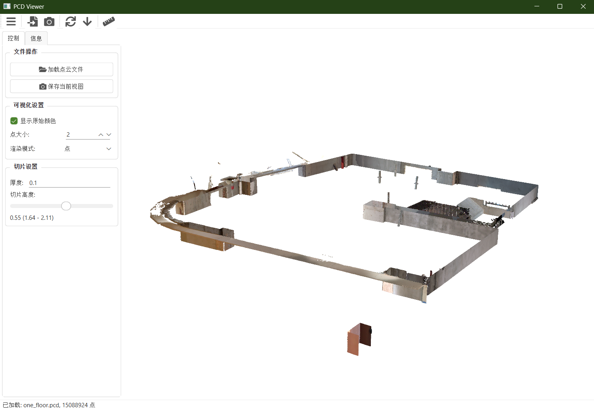

# PCD Viewer


**PCD Viewer** 
是一个由Python与PyQt6编写的轻量级的点云数据可视化和分析工具。

<p align="center">
  
  <br>
  <em>PCD Viewer 主界面</em>
</p>

## 📋 功能特点

### 💾 点云操作
- **加载多种格式**：支持PCD、PLY、XYZ和PTS等格式的点云文件
- **高性能渲染**：基于PyVista/VTK的高效3D渲染
- **颜色显示**：支持显示原始颜色或自定义配色方案

### 🔍 切片功能
- **动态高度切片**：通过滑动条调整切片高度和厚度
- **实时可视化**：切片操作即时反馈
- **灵活参数控制**：可调整相对高度和显示参数

### 📏 直线检测 
- **多种算法**：支持霍夫变换和RANSAC等直线检测方法
- **参数控制**：提供算法参数的精细调整
- **图层显示**：原始图像和检测结果的独立图层控制
- **结果导出**：支持JSON数据和图像结果导出

## 🛠️ 安装指南

### 系统要求
- Python 3.10 或更高版本
- Windows、macOS或Linux操作系统

### 依赖包
```
PyQt6
pyvista
pyvistaqt
open3d
numpy
opencv-python
qtawesome
Pillow
```

### 安装步骤

1. **克隆仓库**
```bash
git clone https://github.com/yourusername/pcd-viewer.git
cd pcd-viewer
```

2. **创建虚拟环境**
```bash
conda create -n pcd-viewer python=3.12
conda activate pcd-viewer
```

3. **安装依赖**
```bash
pip install -r requirements.txt
```

4. **运行程序**
```bash
PYTHONPATH=.. python -m pcd_viewer.main  # Windows
export PYTHONPATH=.. && python -m pcd_viewer.main  # Linux
```

## 📖 使用指南

### 基本操作

1. **加载点云**：
   - 点击工具栏上的"加载点云"按钮
   - 或者使用文件菜单中的"打开"选项

2. **查看点云**：
   - 使用鼠标拖动旋转视图
   - 滚轮缩放视图
   - 右键点击并拖动平移视图
   - 点击工具栏上的"重置视图"重置相机位置

3. **切片操作**：
   - 调整侧边栏中的"厚度"参数
   - 使用"切片高度"滑动条调整切片位置
   - 实时观察切片结果

4. **直线检测**：
   - 点击工具栏上的"直线检测"按钮
   - 选择检测算法和调整参数
   - 点击**直线检测**按钮查看结果或开启**连续检测**

## 🔧 开发与扩展

PCD Viewer设计为可扩展的平台，开发者可以添加新功能：

### 添加新的直线检测算法

1. 在 `utils/line_detection.py` 中创建新的检测器类：
```python
class MyNewDetector(LineDetector):
    def __init__(self):
        # 初始化参数
        
    def detect(self, image):
        # 实现检测逻辑
        
    def get_params(self):
        # 返回参数字典
        
    def set_params(self, params):
        # 设置参数
```

2. 在 `LineDetectionManager` 中注册新算法：
```python
def __init__(self):
    self.detectors = {
        "Hough": HoughLineDetector(),
        "RANSAC": RANSACLineDetector(),
        "MyNew": MyNewDetector()  # 添加新算法
    }
```

## 📦 输出与结果

### 直线检测结果

直线检测功能导出以下内容：

1. **JSON格式数据**：包含检测算法、参数和线条详细信息
```json
{
  "export_time": "2025-01-01T12:34:56.789012",
  "algorithm": "Hough",
  "parameters": {
    "threshold": 100,
    "min_line_length": 50,
    "max_line_gap": 10
  },
  "lines": [
    {
      "id": 0,
      "start_point": [10, 20],
      "end_point": [100, 120],
      "length": 123.45
    },
    // ...更多线条
  ]
}
```

2. **图像结果**：
   - `original.png`：原始图像
   - `lines_only.png`：仅包含检测线条的图像
   - `combined.png`：原始图像和检测线条的叠加图像

## 📝 许可证

本项目采用MIT许可证
---

<p align="center">
  <sub>Built with ❤️ by SCWM_P</sub>
</p>