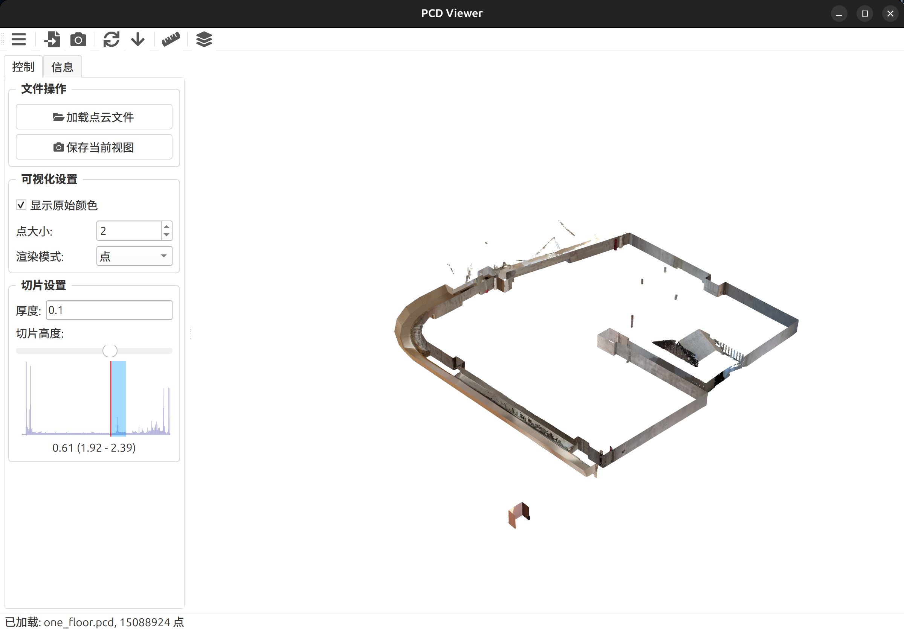
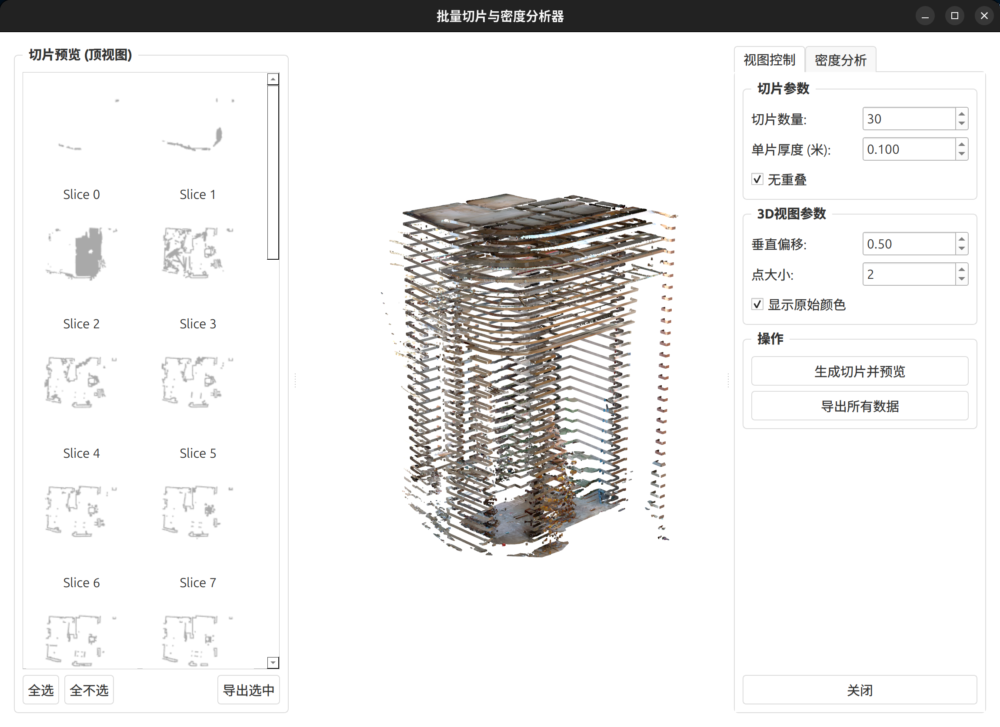
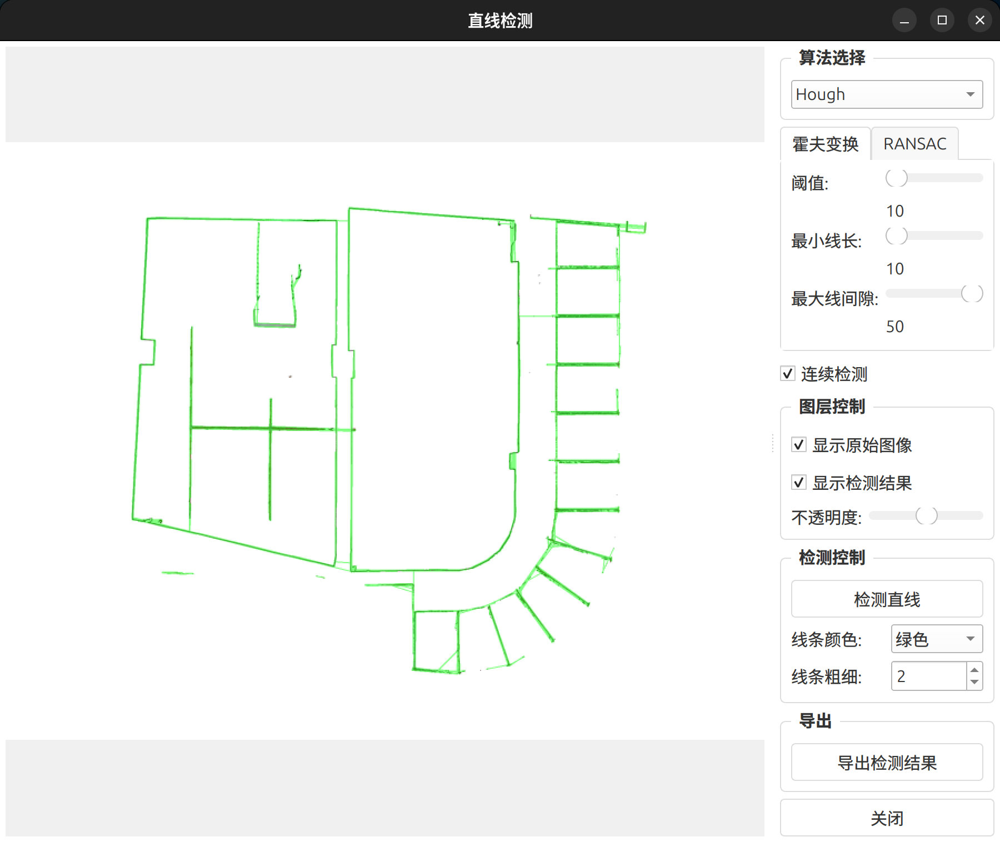

# PCD Viewer


**PCD Viewer** 是一个使用 Python (PyQt6, PyVista, Open3D) 编写的轻量级 3D 点云数据可视化和分析工具，特别针对建筑点云处理流程中的快速查看和分析需求。

<p align="center">
  
  <br>
  <em>PCD Viewer 主界面</em>
</p>

## 📋 功能特点

### 💾 点云操作 & 主视图
- **加载多种格式**: 支持 `.pcd`, `.ply`, `.xyz`, `.pts`, `.txt` 等常见点云格式。
- **高效 3D 渲染**: 基于 PyVista/VTK 实现流畅的 3D 交互（旋转、缩放、平移）。
- **可视化控制**: 支持显示原始颜色、调整点大小、切换渲染模式（点/网格）。
- **高度分布可视化**: 在侧边栏提供点云 Z 轴（高度）分布直方图，直观显示点云在不同高度的密度。
- **动态高度切片**: 通过交互式滑块和直方图，方便地选择和预览指定高度范围的点云切片。
- **视图截图**: 支持保存当前 3D 视图为多种图片格式，并可设置分辨率。

### 🔪 批量切片与密度分析 (独立窗口)
- **批量自动切片**: 根据设定的数量和厚度（可选防重叠）自动将点云分割成多个水平切片。
- **多切片 3D 预览**: 在 3D 视图中同时展示所有切片，并通过垂直偏移清晰区分不同层面。
- **2D 缩略图列表**: 提供所有切片的顶视渲染缩略图列表，方便快速概览和选择。
- **密度热力图**: 计算每个切片在 XY 平面的点云密度，并生成可自定义颜色映射的热力图进行可视化。
- **逻辑运算**: 支持选择两个切片的密度图进行逻辑运算（如差分、并集、交集），并可视化结果。
- **批量结果预览**: 提供滑块快速浏览批量逻辑运算（如序列差分）的结果。
- **数据导出**: 支持将切片数据（`.pcd`）、渲染位图 (`.png`)、密度矩阵 (`.npy`)、密度热力图 (`.png`) 及相关元数据 (`.json`) 批量导出。
  <p align="center">
     <!-- [占位符: 替换为批量切片窗口截图] -->
    <br>
    <em>批量切片与密度分析窗口</em>
  </p>

### 📏 直线检测 (基于视图截图)
- **多种算法**: 集成霍夫变换 (Hough) 和 RANSAC 等常用直线检测算法。
- **参数调整**: 提供交互式界面调整算法关键参数。
- **图层化显示**: 可叠加显示原始截图、检测到的直线或两者。
- **结果导出**: 支持将检测结果（直线坐标、参数）导出为 JSON 文件，并保存相关图像。
  <p align="center">
     <!-- [占位符: 替换为直线检测对话框截图] -->
    <br>
    <em>直线检测功能</em>
  </p>

## 🛠️ 安装指南

### 系统要求
- Python 3.10 或更高版本
- Windows, macOS, 或 Linux 操作系统 (Linux 混合显卡环境可能需要额外配置，参见 `compatibility` 模块)

### 安装步骤

1.  **克隆仓库**
    ```bash
    git clone https://github.com/SCWM-P/pcd_viewer.git
    cd pcd-viewer
    ```
2.  **创建虚拟环境 (推荐)**
    ```bash
    conda create -n pcd-viewer python=3.11 # 或 3.10, 3.12
    conda activate pcd-viewer
    ```
3.  **安装依赖**
    ```bash
    pip install -r requirements.txt
    ```
4.  **运行程序**
    ```bash
    # 从项目根目录运行
    cd ..
    python -m pcd_viewer.main
    # 或者在 Linux/macOS:
    # export PYTHONPATH=.. && python -m pcd_viewer.main
    ```

## 项目结构与扩展

-   `ui/`: 包含所有 PyQt 界面相关模块。
-   `utils/`: 包含核心功能和被 UI 调用的辅助逻辑 (点云处理、可视化、算法等)。
-   `tools/`: 包含非 UI 核心功能、实验性脚本或数据处理工具 (如 `read_slice.py` 用于读取批量导出结果)。
-   `compatibility/`: 处理特定平台（如 Linux 混合显卡）的兼容性问题。
-   `assets/`: 存放 README 图片等静态资源。

## 📝 许可证

本项目采用 MIT 许可证。
---

<p align="center">
  <sub>Built with ❤️ by SCWM_P</sub>
</p>